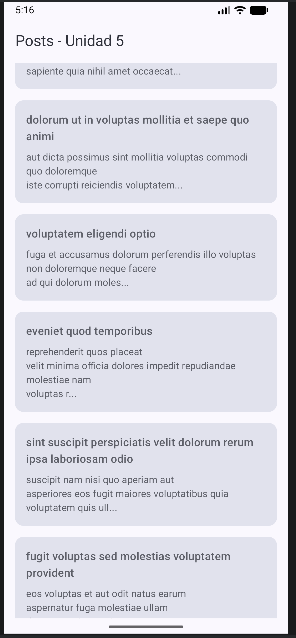
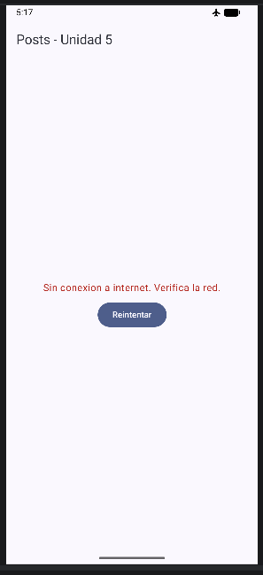
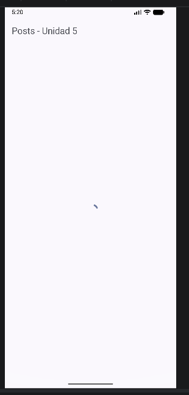

# RetrofitLab

Aplicación Android desarrollada con **Jetpack Compose**, **Retrofit** y **Kotlin Serialization** para consumir posts desde [JSONPlaceholder](https://jsonplaceholder.typicode.com/) y mostrarlos con estados de carga, error, vacío y paginación manual.

## Requisitos

- Android Studio reciente
- JDK 11 o superior
- Android SDK con `compileSdk 36` y `minSdk 27`
- Conexión a Internet para consumir la API pública

## Configuración

1. Clona o abre el proyecto en Android Studio.
2. Sincroniza Gradle.
3. Verifica que el módulo `app` resuelva correctamente las dependencias.
4. Ejecuta la aplicación en un emulador o dispositivo con API 27 o superior.

### Comando útil de verificación

```powershell
.\gradlew.bat :app:compileDebugKotlin
```

## Descripción del flujo implementado

El flujo de la app está organizado por capas:

1. **`MainActivity`** inicia la UI con `PostsScreen`.
2. **`PostsScreen`** observa el estado del `ViewModel` con `collectAsStateWithLifecycle()` y pinta la interfaz según el estado actual.
3. **`PostsViewModel`** solicita datos, administra el estado UI y controla la paginación simple.
4. **`PostRepositoryImpl`** consume la API y transforma los DTOs a modelo de dominio.
5. **`NetworkModule`** configura `Retrofit`, `OkHttp` y el converter de Kotlin Serialization.
6. **`AppError`** convierte errores de red/HTTP en mensajes amigables para la UI.

### Estados de la pantalla

- **Loading**: muestra un indicador circular.
- **Empty**: informa que no hay posts disponibles.
- **Error**: muestra el mensaje y permite reintentar.
- **Success**: renderiza una `LazyColumn` con tarjetas de posts y botón para cargar más.

## Capturas de pantalla

Las imágenes de la app están en `app/captures`.

### 1. Captura principal



### 2. Captura de lista / contenido



### 3. Captura adicional del flujo



> Nota: si deseas, puedes renombrar cada imagen para reflejar mejor el estado exacto que representa, por ejemplo `loading`, `lista`, `error` o `paginacion`.

## Estructura relevante

- `app/src/main/java/com/lab/retrofitlab/MainActivity.kt`
- `app/src/main/java/com/lab/retrofitlab/presentation/ui/PostsScreen.kt`
- `app/src/main/java/com/lab/retrofitlab/presentation/viewmodel/PostsViewModel.kt`
- `app/src/main/java/data/repository/PostRepositoryImpl.kt`
- `app/src/main/java/com/lab/retrofitlab/di/NetworkModule.kt`

## Recomendación de uso

- Usa el botón **Reintentar** si ocurre un error de red.
- Usa **Cargar mas** para solicitar la siguiente página de posts.

## Observación

La app usa una API pública, por lo que el contenido puede variar si el servicio cambia o no hay conexión a Internet.

